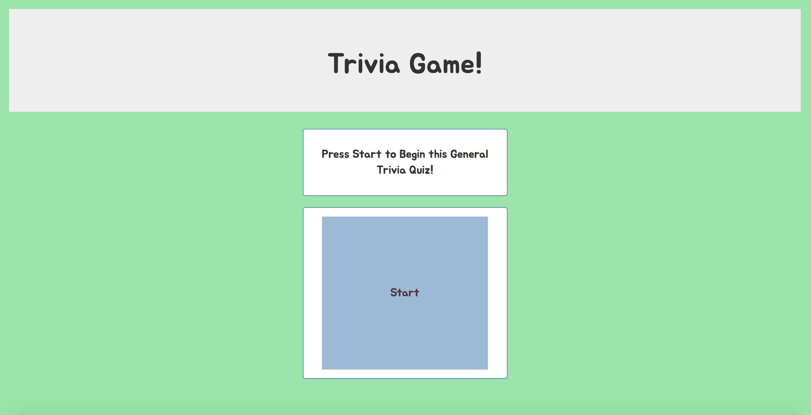
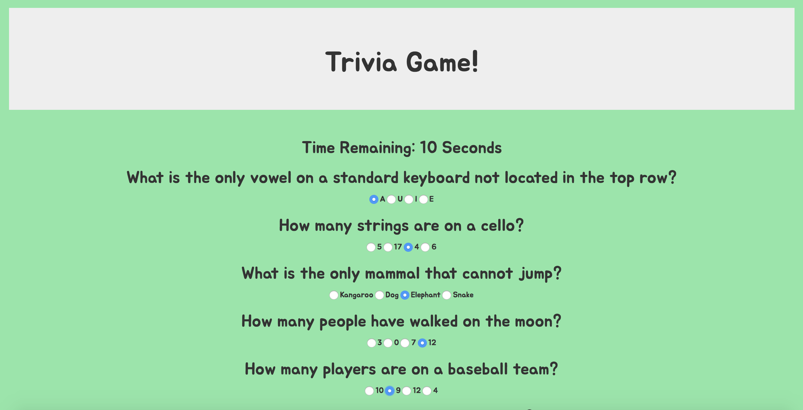
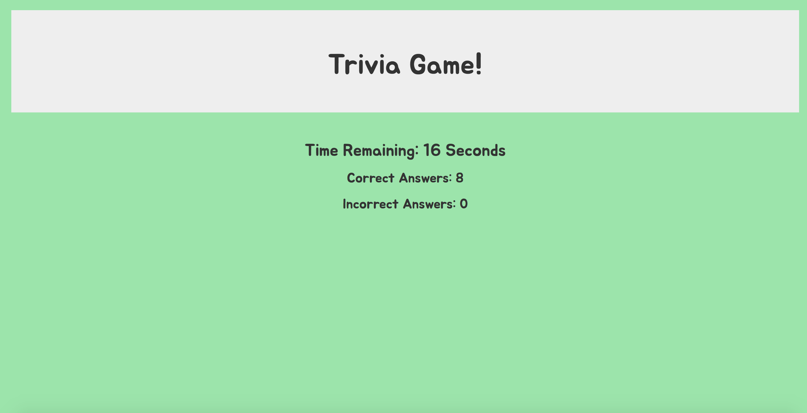

# Trivia-Game

Timed general trivia quiz.

[Trivia-Game](https://peterjuff.github.io/Trivia-Game/)

## Instructions

* Press start.
* You will have 30 seconds to answer all of the questions.
* At the end you will see how many questions were answered correctly.

## Software

* [JQuery](https://jquery.com/)
* [Bootstrap](https://getbootstrap.com/)

# Authors

* [Peter Juffernbruch](https://github.com/peterjuff)

# Acknowledgments

* [Northwestern University Coding Bootcamp](https://bootcamp.northwestern.edu/coding/)
* Homework week five

